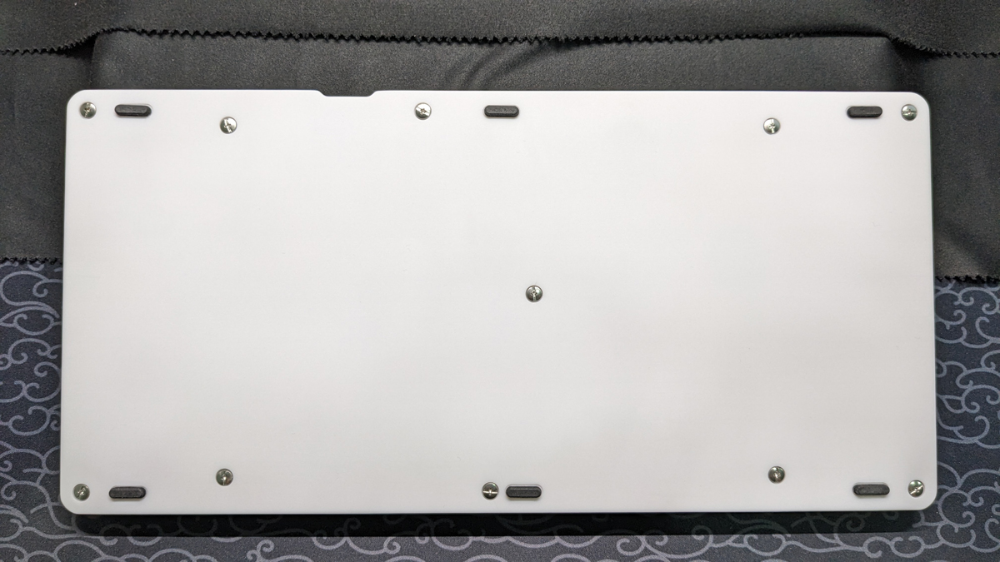

# GuudBox

GuudBox uses GP2040-CE firmware with custom key maps and layouts, here's related links you may need:

[GP2040-CE GitHub page](https://github.com/OpenStickCommunity/GP2040-CE) | [GP2040-CE documentation](https://gp2040-ce.info/introduction)

## Hardwares

__Screwdrivers and soldering iron are necessary to build this device!__

__Screwdrivers and soldering iron are necessary to build this device!__

__Screwdrivers and soldering iron are necessary to build this device!__

### Standard parts

_Parts you need to purchase. All of these should be available in China Mainland._

__Make sure you can get these parts (or compatible ones) before building!__

| Parts                                   | Quantity | Shopping links for reference                                      |
| --------------------------------------- | -------- | ----------------------------------------------------------------- |
| Waveshare RP2040-Zero                   | 1        |                                                                   |
| Gateron low profile switches v2.0       | 18       |                                                                   |
| Gateron low profile hotswap connectors  | 18       |                                                                   |
| 21mm MX switch compatible round keycaps | 12       | [PUNK WORKSHOP](https://item.taobao.com/item.htm?id=684778888971) |
| 26mm MX switch compatible round keycaps | 1        | [PUNK WORKSHOP](https://item.taobao.com/item.htm?id=684778888971) |
| Standard MX switch keycaps              | 6        | [DEADLINE DOYS](https://item.taobao.com/item.htm?id=705145796401) |
| 6x6x10mm push button switches           | 2        | [LCSC](https://item.szlcsc.com/580446.html)                       |
| M3*13 locking screws                    | 6        | [Taobao](https://detail.tmall.com/item.htm?id=714800474141)       |
| M3*5 locking screws                     | 5        | [Taobao](https://detail.tmall.com/item.htm?id=714800474141)       |
| 13x4mm round head silicone foot pads*   | 6        | [Taobao](https://item.taobao.com/item.htm?id=579251575258)        |

_*: Thickness should be greater than 0.5mm._

### Custom parts

| Parts                           | Quantity | Related files                                                                                                         | Remarks       |
| ------------------------------- | -------- | --------------------------------------------------------------------------------------------------------------------- | ------------- |
| Controller PCB                  | 1        | [Gerber_GuudBox.zip](PCB/Gerber_GuudBox.zip)                                                                          | 1.6mm thick   |
| CNC / 3D printed bottom case    | 1        | [Bottom Case.STEP (for CNC)](Case/Bottom%20Case.STEP) / [Bottom Case.STL (for 3D printing)](Case/Bottom%20Case.STL)   |               |
| CNC / laser cutted cover plate* | 1        | [Cover Plate.STEP (for CNC)](Case/Cover%20Plate.STEP) / [Cover Plate.dxf (for laser cutting)](Case/Cover%20Plate.dxf) | 3mm thick     |

_*: If you'd like to replace 21mm round keycaps with 26mm ones, use files in [Alternative](/Case/Alternative) folder for cover plate._

_The RP2040-Zero MCU board should be soldered on __bottom side__ of the controller PCB with __front side up__. Make the position as accurate as possible to avoid conflicts with case._

### Accessories

#### Wrist Rest

- For CNC

| Parts                                 | Quantity | Related files / links                                                            |
| ------------------------------------- | -------- | -------------------------------------------------------------------------------- |
| CNC wrist rest                        | 1        | [Wrist Rest_CNC_low_profile.STEP](Accessories/Wrist%20Rest_CNC_low_profile.STEP) |
| 20x3mm round head silicone foot pads* | 4        | [Taobao](https://item.taobao.com/item.htm?id=579128426494)                       |

_*: Thickness should be greater than 1mm._

- For 3D printing

| Parts                                 | Quantity | Related files / links                                                                    | Remarks       |
| ------------------------------------- | -------- | ---------------------------------------------------------------------------------------- | ------------- |
| 3D printed wrist rest base part       | 1        | [Wrist Rest_3Dp_base_low_profile.STL](Accessories/Wrist%20Rest_3Dp_base_low_profile.STL) |               |
| Laser cutted cover plate              | 1        | [Wrist Rest_3Dp_cover.dxf](Accessories/Wrist%20Rest_3Dp_cover.dxf)                       | 3mm thick     |
| 20x3mm round head silicone foot pads* | 8        | [Taobao](https://item.taobao.com/item.htm?id=579128426494)                               |               |

_*: Thickness should be greater than 1mm._

Here's a sample of 3D printed wrist rest:

### Customizations

Use files in [Misc](/Misc).

[EasyEDA Pro](https://pro.easyeda.com/editor) is needed to edit `.epro` file.

## Softwares

Firmwares are modified and compiled in [AkariiinMKII/GuudBox-GP2040-CE](https://github.com/AkariiinMKII/GuudBox-GP2040-CE).

### Firmware Installation

1. Download the firmware (.uf2 file) in [release page](https://github.com/AkariiinMKII/GuudBox/releases).
2. Hold `BOOT` buttom on MCU board when plugging your controller into a PC. A new removable drive named `RPI-RP2` should appear in your file explorer.
3. Drag and drop the firmware into the removable drive.
4. Wait for the device to automatically disconnect.

### Key Maps

_Default key map in firmware, you can change it in [GPIO Pin Mapping](https://gp2040-ce.info/web-configurator/menu-pages/gpio-pin-mapping) settings._

| Position | GPIO Pin | GP2040-CE  | XInput | Switch  | PS4          | PS3          | DirectInput  | Arcade |
| -------- | -------- | ---------- | ------ | ------- | ------------ | ------------ | ------------ | ------ |
| 1        | 14       | L3         | LS     | LS      | L3           | L3           | 11           | LS     |
| 2        | 15       | R3         | RS     | RS      | R3           | R3           | 12           | RS     |
| 3        | 26       | A1         | Guide  | Home    | PS           | PS           | 13           | Home   |
| 4        | 27       | A2         | -      | Capture | Touchpad     | -            | 14           | -      |
| 5        | 28       | S1         | Back   | Minus   | Share        | Select       | 9            | Coin   |
| 6        | 29       | S2         | Start  | Plus    | Options      | Start        | 10           | Start  |
| 7        | 13       | LEFT       | LEFT   | LEFT    | LEFT         | LEFT         | LEFT         | LEFT   |
| 8        | 12       | DOWN       | DOWN   | DOWN    | DOWN         | DOWN         | DOWN         | DOWN   |
| 9        | 11       | RIGHT      | RIGHT  | RIGHT   | RIGHT        | RIGHT        | RIGHT        | RIGHT  |
| 10       | 10       | UP         | UP     | UP      | UP           | UP           | UP           | UP     |
| 11       | 8        | B3         | X      | Y       | Square       | Square       | 1            | P1     |
| 12       | 6        | B4         | Y      | X       | Triangle     | Triangle     | 4            | P2     |
| 13       | 4        | R1         | RB     | R       | R1           | R1           | 6            | P3     |
| 14       | 2        | L1         | LB     | L       | L1           | L1           | 5            | P4     |
| 15       | 9        | B1         | A      | B       | Cross        | Cross        | 2            | K1     |
| 16       | 7        | B2         | B      | A       | Circle       | Circle       | 3            | K2     |
| 17       | 5        | R2         | RT     | ZR      | R2           | R2           | 8            | K3     |
| 18       | 3        | L2         | LT     | ZL      | L2           | L2           | 7            | K4     |
| 19*      | 0        | Fn         | Fn     | Fn      | Fn           | Fn           | Fn           | Fn     |
| 20**     | 1        | Turbo      | Turbo  | Turbo   | Turbo        | Turbo        | Turbo        | Turbo  |

_*: Disabled by default, enable the function in [Hotkey](https://gp2040-ce.info/web-configurator/menu-pages/settings#hotkey-settings) settings._

_**: Disabled by default, enable the function in [Turbo](https://gp2040-ce.info/add-ons/turbo) settings._

### Configurations

Hold `S2` (position 6 in default key map) when plugging your controller into a PC, and then visit <http://192.168.7.1> in a web browser to access the Web Configurator.

It is strongly recommended to read the [documentation](https://gp2040-ce.info/web-configurator/) before using the configurator.
